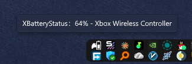
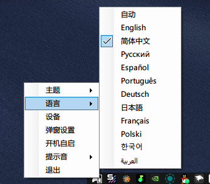
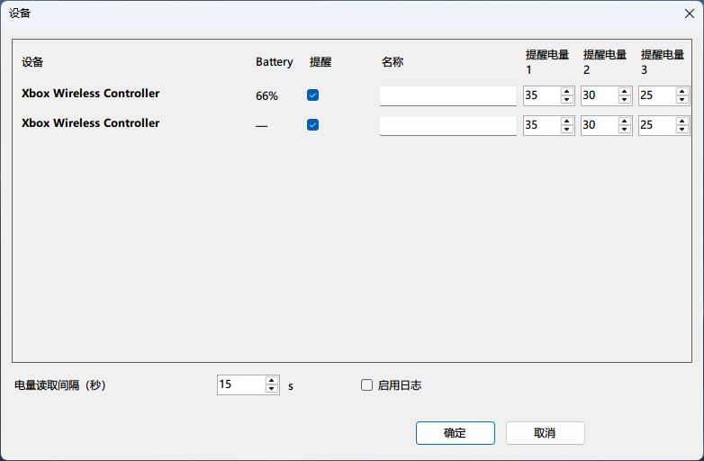
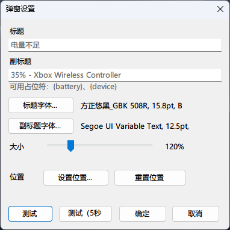

# 🔋 XBatteryStatus

> Monitoruj poziom baterii urządzeń Bluetooth w zasobniku systemowym Windows — z **wyskakującym powiadomieniem w stylu osiągnięcia z Xboxa**, gdy bateria jest niska (Osiągnięcie odblokowane: Twój pad umiera 🤣)

🌐 **Języki:** [English](README.md) | [简体中文](README-zh-CN.md) | [Русский](README-ru.md) | [Español](README-es.md) | [Português](README-pt.md) | [Deutsch](README-de.md) | [日本語](README-ja.md) | [Français](README-fr.md) | [Polski](README-pl.md) | [한국어](README-ko.md) | [العربية](README-ar.md)


## 📸 Prezentacja










---

## ✨ Funkcje

- 🎮 **Monitorowanie wielu urządzeń**: automatycznie wykrywa wszystkie sparowane urządzenia Bluetooth z usługą baterii (pady Xbox, słuchawki Bluetooth, klawiatury i myszy Bluetooth, pady innych marek itd.), bez duplikatów dzięki **adresowi Bluetooth** — urządzenia o tej samej nazwie nigdy się nie mylą
- 🟢 **Powiadomienie w stylu osiągnięcia z Xboxa**: okrąg pojawia się na dole na środku → rozszerza się w kartę → przebiega po niej błysk → automatycznie się zwija. Wierna kopia animacji osiągnięć Xbox Game Bar w Windows 11
- 🎚️ **Trzy konfigurowalne progi**: każde urządzenie może mieć własne 3 wartości (domyślnie 35% / 30% / 25%). Powiadomienie pojawia się raz po przekroczeniu progu, z wykrywaniem gwałtownych spadków (np. 51% → 49% również zadziała)
- ✏️ **W pełni konfigurowalne powiadomienie**: tekst tytułu/podtytułu (z symbolami zastępczymi `{battery}` i `{device}`), niezależne czcionki dla każdej linii, ogólna skala (100%–200%), **interaktywne pozycjonowanie** (strzałki do precyzyjnego ustawienia, Enter do potwierdzenia)
- 🔔 **Dźwięki powiadomień**: kilka wbudowanych dźwięków, obsługa własnych plików `.wav` (wystarczy wrzucić je do folderu `sound` obok exe), domyślnie wyciszone
- 🌍 **Wielojęzyczny interfejs**: chiński uproszczony, angielski, rosyjski, hiszpański, portugalski, niemiecki, japoński, francuski, polski, koreański, arabski; automatycznie przełącza się na chiński na chińskich systemach
- 🚀 **Uruchamianie z Windows**: domyślnie włączone, przełącznik jednym kliknięciem
- 📄 **Przełącznik logowania**: włącz szczegółowe logi w razie potrzeby, zapisywane do folderu exe (limit 10 MB, automatyczne przycinanie)
- 📁 **Przenośność**: wszystkie pliki (konfiguracja, logi, dźwięki) znajdują się w folderze exe — nic nie zaśmieca systemu

## ⚙️ Użytkowanie

Aplikacja mieszka w zasobniku systemowym. Kliknij prawym przyciskiem ikonę:

| Pozycja menu | Opis |
|---|---|
| 🌗 Theme | Motyw ikony: Auto / Jasny / Ciemny |
| 🌐 Language | Język interfejsu (Auto podąża za systemem) |
| 🎮 Devices | Zarządzanie urządzeniami: alerty, progi, nazwy, interwał odczytu, logi |
| 🎨 Popup Settings | Dostosowanie powiadomienia: tekst, czcionki, rozmiar, pozycja |
| 🚀 Uruchamianie z Windows | Uruchamiaj przy logowaniu (domyślnie włączone) |
| 🔔 Dźwięk | Wybór dźwięku powiadomienia (domyślnie wyciszony) |
| ❌ Exit | Zakończ program |

## 🎨 Ustawienia powiadomienia

- **Tytuł / Podtytuł**: własny tekst; pozostaw puste, aby użyć zlokalizowanego domyślnego tekstu. Podtytuł obsługuje symbole zastępcze:
  - `{battery}` → rzeczywisty poziom baterii (np. `35`)
  - `{device}` → wyświetlana nazwa urządzenia
- **Czcionki**: linia tytułu i linia podtytułu mają **własne niezależne czcionki** (rozmiar, grubość)
- **Rozmiar**: ogólna skala od 100% do 200%, wszystko skaluje się proporcjonalnie
- **Pozycja**: kliknij „Set Position..." — powiadomienie pozostaje na ekranie; **strzałki przesuwają o 1 px za naciśnięcie, o 10 px przy trzymaniu**, `Enter` potwierdza, `Esc` anuluje; „Reset Position" w każdej chwili wraca na dół na środek
- **Test**: natychmiast pokazuje testowe powiadomienie; „Test (5s)" pokazuje je 5 sekund później — wygodne do sprawdzenia trybu pełnoekranowego w grze

## 🎮 Urządzenia

- Automatycznie listuje wszystkie sparowane urządzenia Bluetooth z usługą baterii (bez duplikatów po adresie)
- Dla każdego urządzenia można skonfigurować:
  - ✅ Czy alerty niskiego poziomu baterii są włączone (pady domyślnie włączone)
  - 🔢 3 wartości baterii do alertów (1–100%)
  - ✏️ Własną wyświetlaną nazwę (puste = nazwa urządzenia; używana przez symbol `{device}`)
- **Interwał odczytu**: jak często czytać baterię, w sekundach (domyślnie 15 s)
- **Włącz logowanie**: po zaznaczeniu zapisywane są szczegółowe logi działania

## 🌍 Języki

Obsługiwane jest 11 języków: chiński uproszczony, angielski, rosyjski, hiszpański, portugalski, niemiecki, japoński, francuski, polski, koreański, arabski.

- **Auto** (domyślnie): używa chińskiego, gdy język systemu to chiński uproszczony; w przeciwnym razie angielskiego; pozostałe języki wybiera się ręcznie
- Ręczne przełączanie dostępne jest w menu zasobnika

## 🔔 Dźwięk

- Menu zasobnika „Dźwięk" → „Wycisz" lub wybór pliku audio (pozycje menu wypisane według nazwy pliku)
- Własne dźwięki: umieść pliki `.wav` w **folderze `sound` obok exe**; menu odświeża się automatycznie, bez restartu
- Obsługiwany jest tylko format `.wav`

## 📁 Pliki i katalogi

Aplikacja jest z założenia przenośna — wszystko powstaje w **katalogu exe**:

```
📁 katalog exe/
├── 📄 XBatteryStatus.exe      ← główny program
├── 📄 log.txt                 ← log działania (zapisywany przy włączonym logowaniu, limit 10 MB)
├── 📁 sound/                  ← folder dźwięków (tylko odczyt, wrzucaj tu własne wav)
└── 📁 config/                 ← cała konfiguracja
    ├── 📄 settings.json       ← ustawienia aplikacji (język/powiadomienie/dźwięk/start itd.)
    └── 📄 devices.json        ← konfiguracja alertów dla każdego urządzenia
```

## ⚠️ Uwagi

- Gry w **trybie pełnoekranowym Exclusive Fullscreen** nie mogą wyświetlać powiadomienia — to ograniczenie Windows dotyczące wszystkich narzędzi innych firm; przełącz gry w tryb **okna bez ramek** (Borderless Windowed)
- Dla własnych dźwięków obsługiwane są tylko pliki `.wav`
- Alerty działają według zasady „**raz na przekroczenie progu**": ponownie ostrzega tylko po naładowaniu powyżej progu i kolejnym spadku; urządzenie łączące się ponownie już poniżej progu również ostrzeże raz

## 🛠️ Kompilacja

Wymagany jest **.NET 8 SDK** (Windows).

```bash
dotnet build XBatteryStatus/XBatteryStatus.csproj -c Release
```

Wynik zapisywany jest do `XBatteryStatus/bin/Release/net8.0-windows10.0.19041.0/`:

- Wbudowane dźwięki są automatycznie kopiowane do folderu `sound/` wyników
- `config/` i `log.txt` są generowane w czasie działania obok exe; nic nie trzeba tworzyć ręcznie

## ❓ FAQ

- P: Dlaczego powstał ten projekt?

- O: Istniejące narzędzia ostrzegają przez powiadomienia systemu Windows, ale podczas grania Windows domyślnie blokuje powiadomienia poniżej najwyższego priorytetu i trzeba ręcznie ustawić najwyższy priorytet — to uciążliwe. Nawet po ustawieniu, po jakimś czasie Windows pyta, czy wyłączyć powiadomienia aplikacji baterii pada, bo nigdy ich nie otworzyłeś; Microsoft uznaje je za nieważne i zaleca wyłączenie. Dlatego ominąłem natywny kanał powiadomień i zaimplementowałem alerty w inny sposób.

- P: Dlaczego adapter nie pokazuje dokładnego poziomu baterii?

- O: XInput zapewnia tylko 4 poziomy (Empty pusty / Low niski / Medium średni / Full pełny); nie ma dokładnych procentów jak w GATT przez Bluetooth. To ograniczenie samego protokołu XInput; nic na to nie poradzę.

Obsługuje wiele urządzeń

## 🙏 Odniesienia i podziękowania

> https://github.com/NiyaShy/XB1ControllerBatteryIndicator

> https://github.com/tommaier123/XBatteryStatus

> https://github.com/SteamAchievementNotifier/SteamAchievementNotifier

> https://github.com/gopi470/Nox

> https://github.com/SpartanX1/bluetooth_classic_battery_windows

> https://github.com/o0Zz/PeripheralBatteryMonitor

## 🍋 Wsparcie

Podoba Ci się? Postaw mi szklankę lemoniady ~


## 📄 Licencja

- Projekt jest wydany na licencji **GPL-3.0**, patrz [LICENSE](LICENSE).
